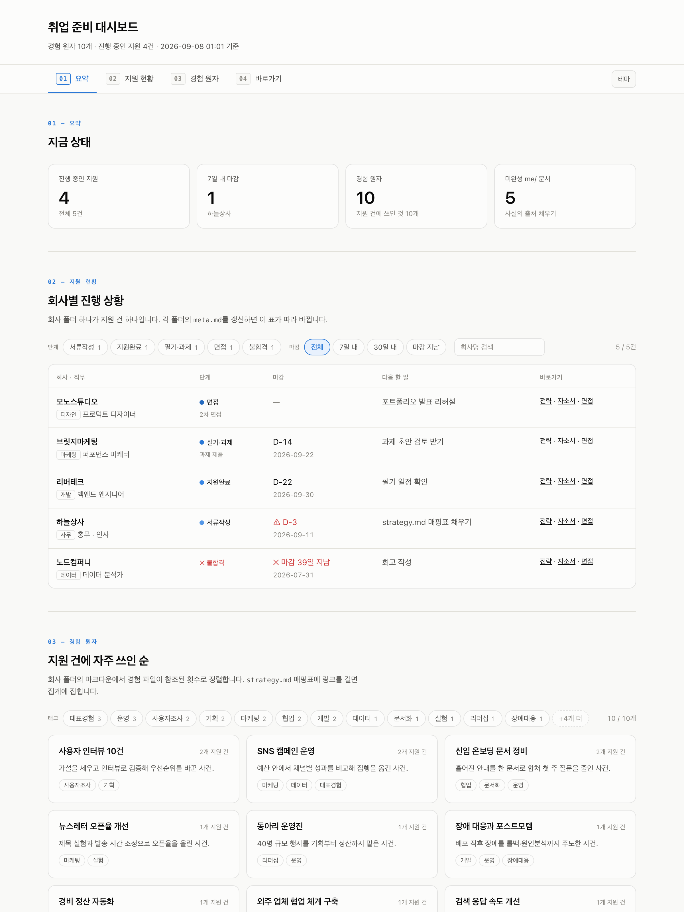

# job-prep-kit

취업 준비를 **파일로 운영**하기 위한 폴더 구조와 대시보드입니다.

회사별 폴더에 자소서를 쓰다 보면 같은 경험이 폴더마다 조금씩 다른 문장으로 복제되고, 내 최신 이력이 어디 있는지 모르게 됩니다.
그래서 경험·역량 같은 사실은 `me/` 한 곳에만 두고, 회사별 자소서·면접 준비는 그 사실을 조합해서 만듭니다.
개발, 디자인, 마케팅, 영업, 사무 어느 직군이든 쓸 수 있고, AI(Claude, ChatGPT 등)와 함께 쓰는 것을 전제로 설계했습니다.



## 무엇을 해주나

- **사실은 한 곳에** — 경험을 사건 단위로 쪼개 `me/experiences/`에 저장하고, 모든 자소서는 여기서만 재료를 가져옵니다.
- **회사별 준비 폴더** — 템플릿을 복사하면 공고 · 리서치 · 전략 · 자소서 · 면접 · 필기·과제 문서가 한 벌 생깁니다.
- **공고 ↔ 경험 매핑표** — 자소서보다 먼저 채웁니다. 비어 있는 칸이 곧 면접 압박 질문입니다.
- **대시보드** — 진행 중인 지원, 마감 D-day, 경험이 몇 군데에 쓰였는지를 한 화면에 보여줍니다.
- **회사를 가로지르는 기록** — 실제로 받은 면접 질문, 필기·과제에서 틀린 유형, 지원 회고를 `library/`에 쌓습니다. 지원 건수가 늘수록 여기가 두꺼워져야 합니다.
- **AI 작업 규칙** — `CLAUDE.md` 한 장으로 AI에게 규칙을 줍니다. 사실은 `me/`에서만 가져오고, 초안 작성과 반박을 맡습니다.

## 필요한 것

| 항목 | 필요한 때 | 설명 |
|---|---|---|
| **[Obsidian](https://obsidian.md)** | 링크 · 대시보드 | 문서를 읽고 쓰는 것만이면 어떤 편집기든 됩니다. 문서 안의 링크와 대시보드의 "문서 열기"를 쓰려면 필요합니다. 아래 안내 참고 |
| **Python 3.8 이상** | 대시보드 | 대시보드를 만들 때만 필요합니다. 따로 설치할 라이브러리는 없습니다 |
| Git | 선택 | ZIP 다운로드로 대신할 수 있습니다 |

> **Obsidian 안내.** 문서 안의 `[[링크]]`와 대시보드의 "문서 열기" 링크는 **기본적으로 Obsidian에서 열리도록** 되어 있습니다.
> 마크다운 파일 자체는 어떤 편집기로도 읽고 쓸 수 있지만, 링크가 동작하려면 이 폴더를 Obsidian **보관함(vault)** 으로 한 번 열어 두어야 합니다.
> Obsidian을 쓰지 않는다면 대시보드를 만들 때 `--links vscode` 또는 `--links file` 옵션을 붙이세요. 자세한 내용은 [대시보드 문서](docs/dashboard.md)에 있습니다.

## 시작하기

> 자기 자료로 쓸 저장소는 **비공개(private)** 로 두세요. 이력서 · 자소서 · 회사별 전략이 들어갑니다.

1. **내려받기** — 이 페이지 위쪽의 `Code → Download ZIP`을 눌러 받고 압축을 풉니다. 터미널이 익숙하면 대신:
   ```bash
   git clone https://github.com/fmaPark/job-prep-kit.git 취업준비
   cd 취업준비
   rm -rf .git && git init      # 여기서부터는 내 기록
   ```
2. **Obsidian에서 열기** — Obsidian을 실행하고 "보관함으로 폴더 열기(Open folder as vault)"에서 압축 푼 폴더를 고릅니다.
3. **`me/` 채우기** — `me/profile.md` → `me/experiences/`(경험 하나 = 파일 하나) → `me/skills.md` → `me/narrative.md` 순서로 씁니다.
4. **회사 추가** — `applications/_template/` 폴더를 복사해 `applications/2026-09-회사명-직무/`로 이름을 바꾸고, `meta.md`부터 채웁니다. 직군(`track`)은 자유롭게 적고, 2차 면접 같은 세부 단계는 `stage_note`에 적습니다.

단계별 자세한 설명은 [시작 가이드](docs/getting-started.md)에 있습니다.

## 대시보드 만들기

이 폴더에서 터미널을 열고 아래를 실행합니다. (Windows는 `python3` 대신 `py` 또는 `python`)

```bash
python3 build-dashboard.py
```

`dashboard.html`이 만들어지면 브라우저로 엽니다. 문서를 고친 뒤에는 다시 실행해야 화면에 반영됩니다.
실행 옵션, 읽어 가는 파일, 링크가 안 열릴 때의 해결법은 [대시보드 문서](docs/dashboard.md)를 보세요.

## AI와 함께 쓰기

`CLAUDE.md`가 AI에게 주는 작업 규칙입니다. Claude Code처럼 이 파일을 자동으로 읽는 도구에서는 그대로 동작하고,
웹 챗에서는 내용을 프로젝트 지침(custom instructions)에 붙여 넣으면 됩니다. 자주 쓰는 요청 문장은 `playbook.md`에 있습니다.
자세한 내용은 [AI와 함께 쓰기](docs/ai-guide.md)를 보세요.

## 한계

- **대시보드는 스냅샷입니다.** 문서를 고쳐도 스스로 바뀌지 않습니다. 볼 때마다 다시 만들어야 합니다.
- **링크는 Obsidian을 가정합니다.** 다른 편집기에서는 대시보드를 `--links` 옵션으로 다시 만들어야 하고, 문서 안의 `[[링크]]`는 그대로 동작하지 않습니다.
- **경험이 쓰인 횟수는 파일 이름 등장 기준입니다.** 매핑표나 자소서에 경험 파일 링크를 걸지 않으면 0으로 셉니다.
- **지원서를 대신 내주지 않습니다.** AI 규칙도 초안과 반박까지입니다. 제출과 최종 판단은 사람이 합니다.

## 더 읽기

- [시작 가이드](docs/getting-started.md) — 내려받기부터 첫 회사 추가까지, 터미널이 낯선 분 기준
- [폴더 구조와 설계 배경](docs/structure.md) — 왜 이렇게 나눴는가, 각 파일의 역할, 문서 규격
- [대시보드](docs/dashboard.md) — 실행 옵션, 읽는 파일, 문제 해결
- [AI와 함께 쓰기](docs/ai-guide.md) — `CLAUDE.md`의 역할과 도구별 적용법
- [플레이북](playbook.md) — 단계별 워크플로우와 요청 문장

## 문의 · 기여

잘못된 안내나 제안은 [GitHub 이슈](https://github.com/fmaPark/job-prep-kit/issues)로 남겨 주세요.
구조와 규칙을 자기 상황에 맞게 바꿔 쓰는 것은 자유입니다.

## 라이선스

MIT. `LICENSE` 참고.
